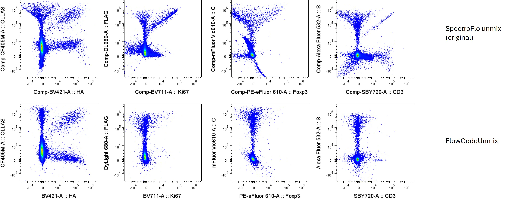

<!-- README.md is generated from README.Rmd. Please edit that file -->

# FlowCodeUnmix

<!-- badges: start -->

<!-- badges: end -->

FlowCodeUnmix is intended to be a complete debarcoding and unmixing
pipeline for spectral flow cytometry samples using the FlowCode protein
epitope barcoding technology.

FlowCodeUnmix is provided under an AGPL3 licence.

To read about FlowCodes see the [Immunity paper by Bricard et
al.](https://www.cell.com/immunity/fulltext/S1074-7613(24)00277-2) and
also the [ProCode
system](https://www.sciencedirect.com/science/article/pii/S0092867418312340?via%3Dihub)
upon which FlowCodes are based.

## Installation

You will need to install the following packages:

- BiocManager
- FlowSOM
- flowWorkspace
- remotes (or devtools)
- AutoSpectral

Everything else should be installed automatically.

Run the code below on your machine to set everything up.

``` r
# Install Bioconductor packages
if (!requireNamespace("BiocManager", quietly = TRUE)) install.packages("BiocManager")
BiocManager::install(c("flowWorkspace", "flowCore", "FlowSOM", "remotes"))

# You'll need devtools or remotes to install from GitHub.
if (!requireNamespace("pak", quietly = TRUE)) install.packages("pak")
if (!requireNamespace("remotes", quietly = TRUE)) install.packages("remotes")
remotes::install_github("DrCytometer/AutoSpectral")
remotes::install_github("DrCytometer/FlowCodeUnmix")
```

FlowCodeUnmix is written in R and should work on any system. R, however,
is not very fast, so the per-cell unmixing part will be slow. To speed
this up, install the Rcpp version available at
[FlowCodeUnmixRcpp](https://github.com/DrCytometer/FlowCodeUnmixRcpp).
This is approximately 100x faster.

## Required inputs

You will need these pieces of information:

- Single-stained control samples, preferably cell-based
- A “backbone”” control sample stained with all the anti-epitope
  antibodies (and nothing else)
- Unstained control cells matching the source used in the backbone
  control
- Unstained control cells matching the source(s) in your fully stained
  samples
- A CSV file describing the valid combinations of epitope barcodes and
  what they correspond to. Example format below: 

## Help

FlowCodeUnmix is based around AutoSpectral. Please see the [help pages
and articles](https://drcytometer.github.io/AutoSpectral/) for
AutoSpectral as a starting point. In particular, see the [AutoSpectral
Full
Workflow](https://drcytometer.github.io/AutoSpectral/articles/01_Full_AutoSpectral_Workflow.html).

For FlowCodeUnmix, see the example workflow in
“FlowCode_Unmixing_Workflow.Rmd”, which is also available on the web at
[FlowCode
Workflow](https://drcytometer.github.io/FlowCodeUnmix/articles/FlowCode_Unmixing_Workflow.html).
You can view all of the functions available in FlowCodeUnmix
[here](https://drcytometer.github.io/FlowCodeUnmix/reference/index.html).

## Examples

Here is what the unmixing looks like for the backbone control (FlowCode
epitopes only) with standard OLS unmixing or using `FlowCodeUnmix`:


You get debarcoded channels in the output FCS file: 

## How it works

What the code does in the unmixing: \* We unmix quickly with weighted
least squares (WLS). \* We do a first pass estimation of each cell’s
best fit autofluorescence signature using minimization of fluorophore
signal (worst case scenario) as the metric. \* We debarcode, which tells
us the best-fitting FlowCode combination (or lack thereof) per cell. \*
We then assess which fluorophores are present (above pos.thresholds) for
a given fluorophore. If none, we return early. AF is always considered
to be present (pos.thresholds for AF is -Inf). We drop down into this
reduced fluorophore space for the optimization workflow because with
fewer endmembers, we have more information in the residuals that we can
use to identify where each cell lies on the multi-dimensional
distribution. \* If a cell is a FlowCode cell (has.flowcode), we need to
perform a correction for FRET. This is done by aligning the residual to
the deltas (fret.delta.list, fret.delta.norms) of the FRET spectra
(combo.fret) for the FlowCode combination (flowcode.ids) present in that
cell. This is done using a reduced set of fluorophores in the spectra
for the cell, based on which fluorophores are positive (pos.thresholds),
and additionally excluding any flowcode.fluors that are not present in
the identified combo for the cell (using flowcode.combo.logical). We
test k variants of FRET spectra (creating a new unmixed channel). The
variant that best reduces the residual is selected. The projected FRET
from this variant is subtracted from the cell’s raw.data (note this
likely requires copying raw.data rather than just viewing it) prior to
running the next steps. We re-unmix using the FRET-subtracted raw.data
to re-establish estimates for fluorophore and AF coefficients. \* For
all cells, we next reassess the autofluorescence (AF). We identify which
AF signatures (af.spectra) has been selected for a given cell based on
af.idx, and construct combined.spectra using the baseline fluorophore
signatures and this AF spectrum. We unmix using the reduced set of
positive fluorophores as spectra, then assess which AF spectrum
(af.spectra) best aligns with the residual. We test k variants for AF,
select the one that gives the lowest residual, reunmix and re-establish
which fluorophores are positive. We store the best AF spectrum in the
final spectra. \* We then assess fluorophores in the same way as for AF.
We do this for each cell for positive fluorophores only, in order from
greatest to least signal. We check for alignment of each fluorophore’s
variants with the residual when the cell is unmixed in the reduced space
(positive fluorophores only). We test k variants and pick the best,
storing it in the final spectra. We track the best residual so we don’t
have to re-unmix at the end of each fluorophore’s loop. \* Finally, we
unmix with the final spectra, which contain all fluorophores. Spectra
for positive fluorophores and AF will have been optimized; spectra for
negative fluorophores will remain untouched. \* FlowCode and
tag-specific channels are created using the debarcoded cell IDs.
