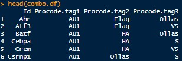

<!-- README.md is generated from README.Rmd. Please edit that file -->

# FlowCodeUnmix

<!-- badges: start -->

<!-- badges: end -->

FlowCodeUnmix is intended to be a complete debarcoding and unmixing
pipeline for spectral flow cytometry samples using the FlowCode protein
epitope barcoding technology.

FlowCodeUnmix is provided under an AGPL3 licence.

To read about FlowCodes see the [Immunity paper by Bricard et
al.](https://www.cell.com/immunity/fulltext/S1074-7613(24)00277-2) and
also the [ProCode
system](https://www.sciencedirect.com/science/article/pii/S0092867418312340?via%3Dihub)
upon which FlowCodes are based.

## Installation

You will need to install the following packages:

- BiocManager
- FlowSOM
- flowWorkspace
- remotes (or devtools)
- AutoSpectral

Everything else should be installed automatically.

Run the code below on your machine to set everything up.

``` r
# Install Bioconductor packages
if (!requireNamespace("BiocManager", quietly = TRUE)) install.packages("BiocManager")
BiocManager::install(c("flowWorkspace", "flowCore", "FlowSOM", "remotes"))

# You'll need devtools or remotes to install from GitHub.
if (!requireNamespace("pak", quietly = TRUE)) install.packages("pak")
if (!requireNamespace("remotes", quietly = TRUE)) install.packages("remotes")
remotes::install_github("DrCytometer/AutoSpectral")
remotes::install_github("DrCytometer/FlowCodeUnmix")
```

FlowCodeUnmix is written in R and should work on any system. R, however,
is not very fast, so the per-cell unmixing part will be slow. To speed
this up, install the Rcpp version available at
[FlowCodeUnmixRcpp](https://github.com/DrCytometer/FlowCodeUnmixRcpp).
This is approximately 100x faster.

## Required inputs

You will need these pieces of information:

- Single-stained control samples, preferably cell-based
- A “backbone”” control sample stained with all the anti-epitope
  antibodies (and nothing else)
- Unstained control cells matching the source used in the backbone
  control
- Unstained control cells matching the source(s) in your fully stained
  samples
- A CSV file describing the valid combinations of epitope barcodes and
  what they correspond to. Example format below:

<figure>

<figcaption aria-hidden="true">Combination file</figcaption>
</figure>

## Help

FlowCodeUnmix is based around AutoSpectral. Please see the [help pages
and articles](https://drcytometer.github.io/AutoSpectral/) for
AutoSpectral as a starting point. In particular, see the [AutoSpectral
Full
Workflow](https://drcytometer.github.io/AutoSpectral/articles/01_Full_AutoSpectral_Workflow.html).

For FlowCodeUnmix, see the example workflow in
“FlowCode_Unmixing_Workflow.Rmd”, which is also available on the web at
[FlowCode
Workflow](https://drcytometer.github.io/FlowCodeUnmix/articles/FlowCode_Unmixing_Workflow.html).
You can view all of the functions available in FlowCodeUnmix
[here](https://drcytometer.github.io/FlowCodeUnmix/reference/index.html).

## Examples

Here is what the unmixing looks like for the backbone control (FlowCode
epitopes only) with standard OLS unmixing or using `FlowCodeUnmix`:


You get debarcoded channels in the output FCS file: 

## How it works

The current implementation (`unmix.flowcode.cpp.staged()`) runs a
five-stage pipeline that brackets a thin FlowCode-specific correction
between two calls into the generic, FlowCode-agnostic AutoSpectral joint
unmixing engine:

- **Initial unmix.** A first, generic AutoSpectral joint unmix
  (`AutoSpectralRcpp::unmix.autospectral.rcpp()`) is run on the raw
  data. Off-target precision doesn’t matter yet here — this pass only
  needs to produce fluorophore coefficients clean enough to debarcode
  on.
- **Debarcode.** `debarcode()` assigns each cell a FlowCode triplet
  combination ID (or “untransduced”/“unrecognised”) from the stage 1
  coefficients, using the per-fluorophore positivity thresholds.
- **Pooled cross-combo background subtraction.** For each FlowCode
  fluorophore, we pool the stage 1 coefficient values across every
  valid-ID cell whose combo does *not* have that fluorophore active, and
  take one population-wide median. This gives a single
  non-specific-background estimate per FlowCode fluorophore, which is
  reconstructed in raw/spectral space and subtracted uniformly from
  every cell — the correction doesn’t vary by combo identity or
  debarcode ID. Pooling across combos (rather than per-combo) is what
  separates true background from FRET: any one combo’s systematic FRET
  in a channel gets diluted out by every other combo where that channel
  isn’t elevated.
- **FRET fit.** For valid-ID cells only, every candidate FRET spectrum
  for the cell’s combo is fit jointly, in a small OLS, together with the
  combo’s own active tag fluorophores and the fixed-shape mean AF
  spectrum, against the background-corrected raw data. The candidate
  minimising the L1 residual is kept, and its fitted contribution is
  subtracted from that cell’s raw data. Off-target FlowCode channels are
  already handled by the background step, so they aren’t part of this
  fit’s basis at all.
- **Final unmix.** A second, generic AutoSpectral joint unmix is run on
  the background-and-FRET-corrected raw data. This pass is the one that
  matters for accuracy: for each cell, it works in the reduced space of
  fluorophores that are actually positive (plus AF, which is always
  considered present), testing candidate spectral variants for each
  positive fluorophore and for AF and keeping whichever minimises the
  residual. This is the reported result.
- **FlowCode and tag channels** are built from the final unmixed
  coefficients using the debarcoded combination IDs, giving a `FlowCode`
  transduction channel and one channel per valid combination.
